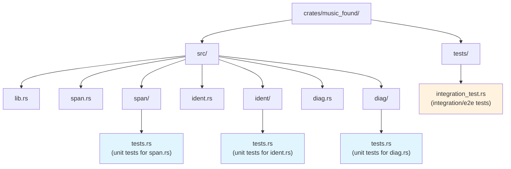

# Project Instructions

## Musi Language Reference

Musi is NOT C, JavaScript, Rust, or Python. When writing or editing `.ms` files, use Musi syntax exclusively. Never substitute C/JS/Rust operators or keywords.

### Forbidden C-isms

| Wrong (C/JS/Rust)   | Correct (Musi)                       | Notes                                                 |
| ------------------- | ------------------------------------ | ----------------------------------------------------- |
| `&&`                | `and`                                | Type-directed: logical on Bool, bitwise on Int        |
| `\|\|`              | `or`                                 | Type-directed: logical on Bool, bitwise on Int        |
| `!x`                | `not x`                              | Type-directed: logical on Bool, bitwise on Int        |
| `&`                 | `and`                                | No separate bitwise operators                         |
| `\|` (bitwise)      | `or`                                 | No separate bitwise operators                         |
| `^`                 | `xor`                                | No separate bitwise operators                         |
| `~`                 | `not`                                | No separate bitwise operators                         |
| `==`                | `=`                                  | Single equals is comparison                           |
| `!=`                | `/=`                                 | Slash-equals                                          |
| `x = 5` (assign)    | `x := 5` (bind) or `x <- 5` (mutate) | `:=` binds, `<-` mutates                              |
| `if/else`           | `(x if cond \| y if _)`              | Piecewise expressions, no if/else                     |
| `{ ... }` (blocks)  | `( ... )`                            | Parens for blocks/sequences                           |
| `fn f()`            | `let f := () => ...`                 | No fn keyword                                         |
| `null`/`nil`        | `.None`                              | Variant, dot-prefixed                                 |
| `true`/`false`      | `.True`/`.False`                     | Variants, dot-prefixed, capitalized                   |
| `enum`              | `choice { A \| B : T }`              | `\|` separates variants, `:` for payload              |
| `struct`            | `record { x : T; y : U }`            | Fields separated by `;`                               |
| `x.field` (obj lit) | `.{ field := value }`                | Record literals use `.{`                              |
| `=>` (match arm)    | `=>`                                 | Same, but match uses `\|` separator and `( )` wrapper |
| `->` (fn type)      | `->` (pure) / `~>` (effectful)       | Two arrow types                                       |
| `#[attr]`           | `@attr`                              | Rust-style attributes replaced by `@` prefix          |
| `'T`                | `T` (declared in `[T]`)              | No tick prefix for type variables                     |
| `enum { A, B }`     | `choice { A \| B }`                  | `\|` separates variants, not `+`                      |
| `A + B` (type sum)  | `A \| B`                             | `+` is arithmetic only                                |

### Key Syntax Rules

- **Comments**: `//`, `///` (doc), `/** */` (doc), `/* */`
- **Strings**: `"double quotes"` only. F-strings: `f"x is {x}"`
- **Runes**: `'a'` (single character)
- **Keywords** (29): `let`, `mut`, `return`, `match`, `if`, `in`, `and`, `or`, `xor`, `not`, `record`, `choice`, `of`, `as`, `where`, `class`, `instance`, `law`, `via`, `effect`, `need`, `handle`, `with`, `resume`, `export`, `import`, `foreign`, `opaque`, `quote`
- **No** `fn`, `func`, `def`, `type`, `enum`, `struct`, `else`, `elif`, `switch`, `case`, `while`, `for`, `loop`, `fatal`, `defer`, `try`
- **Semicolons** separate statements in sequences; trailing `;` makes value `Unit`
- **Variants** are dot-prefixed: `.Some(x)`, `.None`, `.Ok(v)`, `.Err(e)`
- **Type params** use `[T]` brackets: `let id[T] := (x : T) : T => x`
- **Attributes**: `@name` or `@name(args)` -- metadata annotations, runtime-inspectable
- **Choice variants** use `|` separator and `:` for payload: `choice { Some : T | None }`
- **Quote/splice**: `quote (expr)` captures syntax. `$name`, `$(expr)`, `$[exprs]` splice into quotes.
- **Mut model**: `let`/`let mut` for binding mutability. `mut` on values for data writability.
- **Anonymous sums**: `A | B` in type position. No `+` or `*` in types -- those are arithmetic only.
- **Matrix syntax**: `[a, b; c, d]` -- semicolons separate rows
- **Comprehensions**: `[x * 2 | x in xs]` -- `in` is a keyword
- **Types as values**: Types bound via `let`. `let MyInt := Int;` is a type alias. `record`, `choice`, `effect`, `class` are anonymous expressions always bound via `let`.
- **Opaque exports**: `export opaque let T := ...` -- hides internal representation
- **Pipeline**: `x |> f` equals `f(x)`
- **Cons**: `x :: xs`
- **Ranges**: `1..10` (inclusive), `1..<10` (exclusive)
- **Spread**: `...arr`
- **Optional chain**: `x?.field`, **Force**: `x!`, `x!.field`
- **Type test**: `x :? Type`, **Type cast**: `x :?> Type`

### Before Editing `.ms` Files

1. Read `grammar.abnf` and `docs/` if unsure about syntax
2. Check existing stdlib files for idiomatic patterns
3. Never use C/JS/Rust operators - Musi has its own operator set

## Rust Test Convention (IMPORTANT)

Unit tests are NEVER inside source files. No `#[cfg(test)] mod tests { }` blocks.

Unit tests go in `module_name/tests.rs`. Integration and e2e tests go in `tests/` alongside `src/`. This applies to ALL Rust crates in this project.



## Error Testing Convention

- Tests in `errors/tests.rs` or `diag/tests.rs` MAY check Display output strings -- they test the Display impl itself
- Tests OUTSIDE error/diag modules MUST check error variants via `matches!`, never message strings
- Error messages are implementation details; the variant is the contract

```rust
// CORRECT (lexer test):
assert!(matches!(errors[0], LexError::InvalidHexEscape { .. }));

// WRONG (lexer test):
assert_eq!(errors[0].to_string(), "invalid hex escape...");
```

## API Stability Convention

Stabilise the public API early, even during initial development. Breaking changes are cheaper now than later, but that means getting the API right NOW:

- Drop owned `String` from token types when a `Span` index into source suffices
- Use `Span`-carrying structs (like `Trivia { kind, span }`) instead of `String`-carrying enums
- Store positions as native `usize` internally, convert to `u32` only at the `Span` boundary
- Use `PhantomData<fn() -> T>` to avoid trait bounds on generic wrappers (enables derives)
- Collapse redundant enum variants using flags and mode enums (`AccessMode`, `PostfixOp`, etc.)
- Suffix convention: `Lit` for value construction, `Def` for type definition, no suffix for operations

## Micro-Optimisation Conventions

Apply these during initial implementation, not as afterthoughts:

- Avoid allocating `String` when borrowing from source via `Span` is sufficient
- Check conditions before allocating (e.g., only filter number strings when they contain `_`)
- Use table-driven dispatch (const arrays of `(&[u8], TokenKind)`) over nested match arms
- Prefer `usize` for internal indices, convert to `u32` at boundaries only
- Use `derive` over manual trait impls wherever possible (saves LOC, reduces bugs)

## Collaboration Protocol

### Adaptive Depth

- Default to the level the conversation establishes
- If user asks "why": go deeper with technical evidence
- If user asks "simplify" or seems unfamiliar: shift to plain-language analogies
- Never assume the user already knows your reasoning - state it

### Decision Protocol

- **Low stakes** (naming, formatting, imports, obvious fixes): act, mention in summary
- **Medium stakes** (data structure choice, API shape, dependencies, public naming, pattern deviation): present 2-3 options with one tradeoff each, recommend one, wait
- **High stakes** (deleting working code, schema changes, public API changes, new architecture, contradicting plan, security): present analysis + recommendation, wait for explicit approval
- **Default**: when unsure which tier, go one level up
- When a plan exists, follow it - the plan already made the high-stakes decisions
- End decision prompts with "which direction resonates?" not "what do you think?"

### Finish or Flag

- Complete the task entirely, or name the specific part you cannot complete and why
- NEVER silently drop scope. NEVER leave stubs
- NEVER say "for now..." - either do it or explain why not

### Evidence Over Empathy

- State flaws with evidence (file:line), not softened for social reasons
- Do not praise code quality unless asked
- Do not begin responses with agreement/validation phrases
- Focus on the codebase, not the user's emotional state

## Behavioral Constraints

- No filler words: "robust", "seamless", "comprehensive", "cutting-edge", "leverage", "utilize", "facilitate", "enhance", "ensure", "empower"
- No stub code, no unfinished markers, no "in a real implementation", no incomplete function bodies
- No obvious comments: code that needs "what" comments needs renaming
- Evidence-based claims only: "this breaks X because Y at file:line" not "this might cause issues"
- Don't add features beyond what was asked - but do finish everything that WAS asked

## What Not To Do

- Don't silently reduce scope - if something can't be completed, say so and let user decide
- Don't assume user already knows your reasoning - state rationale for medium/high stakes decisions
- Don't narrate trivial steps - DO explain non-obvious choices
- Don't pad with preamble or recap
- Don't praise or filler
- Don't present a single option as the only way for non-trivial decisions
