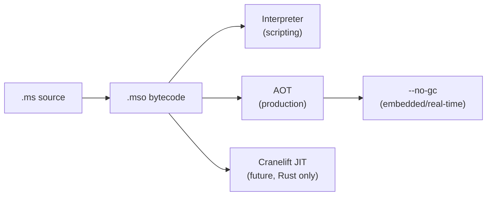

# §1 — Identity & Axioms

## 1.1 What MUSI Is

A **typed predicate logic language with a runtime.** Not OOP. Not purely functional. Not C-family. Every construct is a mapping between sets.

| Concept   | Formal meaning                    |
|-----------|-----------------------------------|
| Value     | mapping ∅ → ∅                     |
| Function  | mapping between types             |
| Type      | set with a predicate              |
| Module    | mapping from names to values      |
| Typeclass | mapping from types to capabilities|
| Program   | mapping from input state to output state |

## 1.2 Design Axioms

| Axiom             | Statement |
|-------------------|-----------|
| Coherence         | One way to do each thing. No synonyms, no shortcuts. |
| Minimality        | 24 keywords, each irreplaceable. |
| Expression-first  | Everything is an expression. No statement/expression split. |
| Immutability-first| All bindings immutable by default. Mutation is explicit opt-in. |
| Effect-tracked    | Every side effect is visible in the type signature. |
| LL(1)             | One token lookahead. No backtracking. Semicolons mandatory. |
| Scripting-first   | Fast startup, REPL, minimal ceremony. |
| Systems-second    | Manual memory, FFI, `--no-gc` are explicit opt-ins. |
| No implicit coercion | All coercion explicit via `Into`. |
| No circular imports  | Dependency graph is a strict DAG. |

## 1.3 What MUSI Is Not

These defaults from other languages do **not** apply. An LLM or implementor must not assume them.

| Do not assume | Reason |
|---|---|
| `=` is assignment | `=` is equality. `:=` is binding. `<-` is mutation. |
| `!=` is inequality | Inequality is `/=`. `!=` does not exist. |
| `&&` `\|\|` `!` exist | Logical operators are `and` `or` `not` `xor` — keywords. |
| `&` `\|` `^` `~` exist | Bitwise ops are the same `and`/`or`/`xor`/`not` — type-directed. |
| `null` / `nil` exist | Use `Option`. There is no null pointer. |
| Implicit numeric promotion | No coercion of any kind without explicit `Into`. |
| `for` / `while` loops exist | Iteration is tail recursion or `Iterable` typeclass. |
| `if/else` exists | Conditionals are piecewise expressions only. |
| Braces delimit blocks | Blocks are parenthesised. `(;)` is an empty sequence. |
| `var` appears in types | `var` is a binding-site keyword only. |
| `inout` is a type modifier | `inout` is a parameter mode — it precedes the name, not the type. |
| Call site must annotate mutation | Call sites are clean. Mutation is visible in the signature only. |

## 1.4 Closest Languages

Nim, Gleam, Koka, Roc, F#. When a design question is ambiguous, consult these — not C, Java, or Python.

## 1.5 Execution Targets

## 1.6 File Extensions

| Extension | Purpose |
|---|---|
| `.ms`  | MUSI source file |
| `.mso` | MUSI bytecode object |

## 1.7 Syntactic Sugar

| Sugar   | Desugars to         |
|---------|---------------------|
| `()`    | `Unit` type and value |
| `?'T`   | `Option of 'T`      |
| `(,)`   | empty tuple         |
| `(;)`   | empty sequence — evaluates to `()` |
