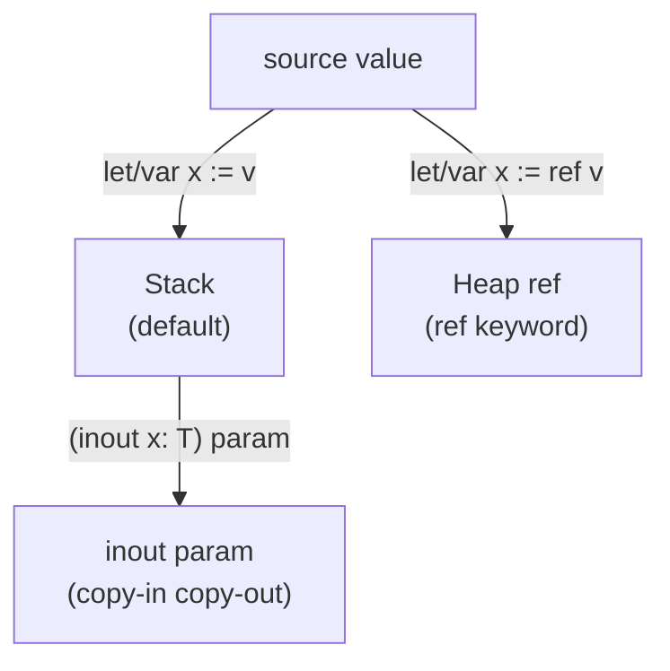
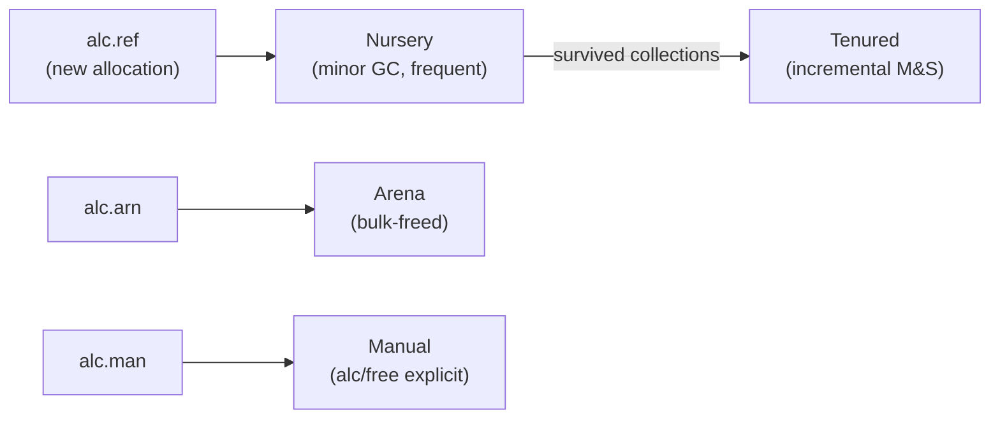

# §5 — Effects & Memory

## 5.1 Effect System

`->` = pure. `~>` = effectful. Effects declared with `under { ... }`. Undeclared effects are compile errors — not warnings, not lint.

```musi
let add      : Int * Int -> Int;
let readFile : Path ~> Bytes under { IO };
let fetch    : Url ~> String under { IO, Async };
```

### Built-in effects

| Effect | Meaning |
|--------|---------|
| `IO` | Filesystem, network, stdio |
| `Async` | Asynchronous suspension |
| `State` | Mutable state via `var` |
| `Unsafe` | Raw memory, FFI |
| `Manual` | Manual allocation under `--no-gc` |
| `Arena` | Arena-scoped allocation, bulk-freed at scope exit |
| `Throw of 'E` | Recoverable failure — replaces exceptions |
| `Control` | Non-local control flow |

### Effect operation typing

`Never` resume type = continuation cannot be resumed, only aborted.

```musi
effect Throw of 'E { raise : 'E -> Never }
effect Async       { suspend : () -> ()  }
effect State of 'S { get : () -> 'S; put : 'S -> () }
```

### Continuations

Single-shot only. The verifier treats the continuation as a linear token — consumed on `eff.res` or `eff.abt`, dead thereafter. A second use is a compile error.

### Handlers

Dynamically scoped, statically checked. Missing handler at a function boundary = compile error.

### Effect variables

```musi
let map : forall 'T 'U 'E ->
    ('T ~> 'U under 'E) -> Array of 'T ~> Array of 'U under 'E;
```

## 5.2 Throw

```musi
let divide := (a, b: Int) ~> Int under { Throw of DivisionByZero } -> (
    a / b                   if b /= 0
  | raise(DivisionByZero)   if _
);

let result := try divide(10, 2);
```

## 5.3 Memory Model



### Binding × mutability matrix

| Declaration | Rebind? | Mutate contents? | Heap? |
|-------------|---------|------------------|-------|
| `let x := v` | No | No | No |
| `var x := v` | Yes | Yes | No |
| `let x := ref v` | No | Yes | Yes |
| `var x := ref v` | Yes | Yes | Yes |
| `(x: T)` param | No | No | No |
| `(var x: T)` param | Yes (local) | Yes (local) | No |
| `(inout x: T)` param | — | Yes (caller's) | No |
| `(x: ref T)` param | No | Yes | Yes (caller's) |

### inout semantics (Ada-style)

- **Mode position**: `inout` precedes the parameter name, not the type.
- **Not a type modifier**: the type of `x` inside the function is `T`, not `inout T`.
- **Call site is clean**: no annotation at call site. Mutation intent visible in signature only.
- **No heap allocation**: copy-in copy-out on the stack.
- **Lowering**: lowers to pointer-passing in IR. No `inout` concept exists in bytecode.

```
let increment := (inout n: Int) -> (n <- n + 1);
var x := 5;
increment(x);    // x is 6 after call — clean call site
```

### ref semantics

`ref` = heap-allocated, shared identity, always mutable through. No qualifier needed or permitted.

`let`/`var` on a `ref` binding controls only whether the binding name can be repointed. The object is always mutable.

## 5.4 GC Design

Generational, non-moving, incremental tri-color mark-and-sweep.



- **Non-moving**: `ref` pointers are stable addresses — safe across GC cycles.
- **Precise**: type pool gives exact pointer map per object layout. No conservative scanning.
- **Incremental**: no stop-the-world pauses.
- **Write barrier**: tenured→nursery pointer stores mark a card table entry. Nursery GC scans dirty cards as additional roots.

## 5.5 Arena Effect

Bulk-freed at scope exit. No individual `free` needed. Suitable for request/response cycles, game loops, parsers.

```musi
let processRequest := (req: Request) ~> Response under { Arena } -> (
    let buf := alc.arena Bytes(1024);   // freed when function returns
    ...
);
```

Arena pointers must not escape the arena scope — compile error if they do.

## 5.6 Manual Memory (`--no-gc`)

All `ref` allocations require `Manual` effect. `Manual` is contagious — callers must declare it.

```
let p := alc Point;
defer free(p);
```

### GC/Manual boundary rules (compile errors)

1. Passing a GC `ref` into `Manual` context without `Unsafe`
2. Storing a `Manual` pointer into a GC-managed object
3. Calling a `Manual` function from GC context without declaring `Manual`

`pin` roots a GC object and yields a stable `Ptr` for FFI:

```musi
let pin : forall 'T -> ref 'T ~> Ptr of 'T under { Manual, Unsafe };
```

## 5.7 defer

```musi
defer f.close();
defer (
    release(a);
    release(b);
);
```

LIFO. Sequence block deferred as a unit. Cannot be used in tail position.
