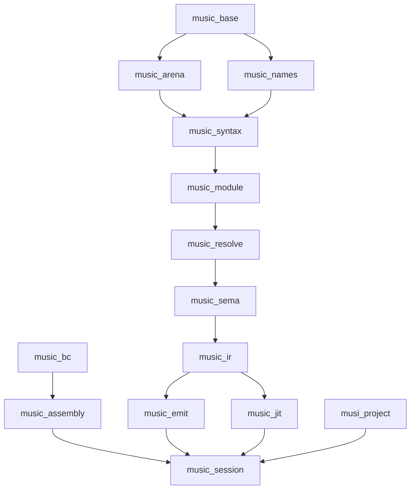

# Architecture

This document defines the semantic ownership map from Musi source to the runtime boundary.

It does not describe the current Rust crate graph. It describes the stable responsibilities the implementation must preserve.

## Design Principle

Each layer owns one transformation or one runtime responsibility.

The architecture stays honest when:

- surface syntax is defined by the language docs and grammar
- semantic analysis owns meaning, not ad hoc emitter/runtime recovery
- SEAM owns runtime contracts, not source sugar
- the runtime owns execution and embedding, not compile-time language decisions

## Canonical Workspace (`crates_new/`)

The canonical compiler implementation lives in `crates_new/` and is designed as an embeddable compiler-as-a-service (CaaS):

- Phase crates expose domain APIs for tooling and embedding.
- The service/orchestration layer owns caching, invalidation, and project integration.
- Dependencies must form a DAG (no circular compiler-phase deps).

Canonical crate domains (new workspace):

- `music_base`: spans, sources, diagnostics, and foundation utilities
- `music_arena`: typed ids, arenas, and append-only slice storage shared by syntax/tree layers
- `music_names`: interning, identifiers, known symbols, and name-resolution data structures
- `music_syntax`: lexer + parser + full-fidelity syntax tree (grammar-aligned)
- `music_module`: module/specifier model and `ImportEnv::resolve` query contract (pre-resolve)
- `music_hir`: semantic IR data model
- `music_resolve`: import graph discovery + name resolution + syntax→HIR lowering
- `music_sema`: type/effect/class semantic analysis
- `music_ir`: codegen-facing facts derived from sema output
- `music_bc`: SEAM bytecode contract (artifact tables + ISA)
- `music_assembly`: encode/decode/format/validate for `music_bc`
- `music_emit`: SEAM emission (lowering from sema/IR facts to `music_bc`)
- `music_jit`: native/JIT backend consuming `music_ir` (planned)
- `music_session`: embeddable service layer (caching + orchestration)
- `musi_project`: schema-backed project/manifest integration (`musi.json`, workspaces, package graph, registry/cache resolution)

Current implementation status (Cargo workspace members):

- `music_base`
- `music_arena`
- `music_names`
- `music_syntax` (lexer + parser + CST/AST views)
- `music_module`
- `music_hir`
- `music_resolve`
- `music_sema`
- `music_ir`
- `music_bc`
- `music_assembly`
- `music_emit`
- `music_session`
- `musi_project`

The intended dependency shape is a DAG:

## Legacy Workspace (`crates/`)

The legacy compiler lives in `crates/` and is reference-only.

The rewrite does not add new public API surface to legacy crates. Use `crates/` as an implementation reference and for metrics (e.g. LOC comparisons), not as the canonical compiler.

## Ownership Chain

### 1. Source Language

The language layer owns:

- syntax
- type and effect surface
- attrs
- FFI declarations
- metaprogramming surface

These are defined by the language and reference docs, not by implementation accidents.

### 2. Parsing And Syntax

The syntax layer turns source text into a structured program representation.

It owns:

- tokenization
- grammar
- operator and guard structure
- syntax trees and source spans

It does not decide meaning beyond what is necessary to represent the parsed program correctly.

### 3. Name And Module Resolution

The resolution layer owns:

- import graph discovery
- resolved module targets for import expressions
- module identity and export-policy summaries for downstream phases
- explicit local visibility introduced by user bindings and patterns
- binding and reference resolution
- compiler-owned surface seeding

It decides what names refer to. It does not decide whether the resulting program is well-typed.

### 4. Type And Effect Analysis

The semantic layer owns:

- type checking
- effect checking
- class and instance resolution
- imported-module member typing and explicit module destructuring through semantic module surfaces
- whole-program instance coherence across the reachable static-import graph
- law and attr validation where they affect language meaning
- FFI surface validation at the language boundary

Its output is the authoritative typed program representation used by lowering.

### 5. Lowering To SEAM

The lowering layer owns:

- translation from typed language constructs to SEAM
- closure, effect, typeclass, aggregate, and foreign-call lowering
- merged-program assembly where multiple modules become one executable artifact

This is where source sugar disappears and runtime contracts become explicit machine-level operations.

### 6. SEAM Contract

SEAM owns the binary and text runtime contract:

- bytecode families
- metadata tables
- runtime-visible descriptors
- loader-facing format invariants

SEAM is the handoff point between compilation and execution.

### 7. Runtime And Embedding Boundary

The runtime layer owns:

- loading `.seam` into a program object
- execution through the VM
- host effect handling
- native library and symbol resolution
- stable value inspection for embedding

The runtime boundary is documented in the runtime and SEAM docs, not redefined here.

## Compiler-Owned Surface

The compiler-owned surface stays intentionally small:

- compiler-owned language definitions
- intrinsic modules and bridges
- builtin runtime-visible type, effect, class, and variant metadata

Everything else is ordinary library or package surface:

- `@std/...` remains library surface
- user attrs outside reserved compiler namespaces remain metadata
- native and host interaction stays explicit through `foreign`, runtime host capabilities, and compiler-owned intrinsic boundaries

## Boundary Rules

To keep the architecture stable:

- parsing does not guess semantic meaning the type/effect layer should decide
- semantic analysis does not depend on emitter or VM recovery
- SEAM does not preserve removed source sugar
- the runtime does not invent a second startup model separate from top-level module execution
- embedding APIs expose runtime values and metadata, not compiler internals

## Tooling Boundary

The outer tool boundary also stays split by responsibility:

- `music` is the low-level compiler/runtime driver over source and `.seam`
- `musi` is the package-aware operator tool over manifests, entries, tasks, tests, and dependency workflows
- schema-backed tooling such as fmt/lint/bench/publish/lock belongs to the Musi framework without being confused with compiler-core behavior

That tooling split sits above the language-to-runtime ownership chain described here. It does not redefine the semantic layers underneath it.

## Reading Order

This architecture doc sits after the language, SEAM, and runtime API docs on purpose.

Read those first for:

- language surface
- SEAM VM and bytecode contract
- runtime embedding boundary

Then read this document as the ownership map across them.
