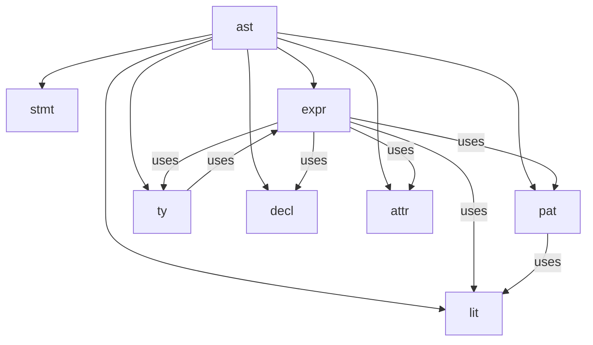

# §9 — AST

## 9.1 Conventions

`?` = optional. `*` = zero or more. `+` = one or more. `Box<>` on recursive fields only.

Each syntactic category is a Rust module with a `Node` enum. Variants are unprefixed and referenced as `expr::Node`, `pat::Bind`, `ty::Ref` etc. Declarations are `expr::Node` variants — no separate `Decl` category.

## 9.2 Module Hierarchy



## 9.3 stmt

```
stmt::Node
  expr: expr::Node
  // semicolon consumed, not stored
```

## 9.4 expr

```
expr::Node =
  // literals & names
    Lit       { lit: lit::Node }
  | Name      { ident: String }

  // bindings — BindKind distinguishes let vs var
  // heap: true = ref keyword present
  | Let       { kind: BindKind, heap: Bool, pat: pat::Node,
                ty: ?ty::Node, value: Box<expr::Node> }
  | LetIn     { kind: BindKind, heap: Bool, pat: pat::Node,
                ty: ?ty::Node, value: Box<expr::Node>, body: Box<expr::Node> }

  // functions — anonymous, name comes from enclosing binding
  | Fn        { params: Param*, arrow: Arrow, ret_ty: ?ty::Node, body: Box<expr::Node> }
  | Call      { callee: Box<expr::Node>, args: Arg* }

  // access & update
  | Field     { object: Box<expr::Node>, field: FieldKey, safe: Bool }
  | Index     { object: Box<expr::Node>, index: Box<expr::Node> }
  | Update    { base: Box<expr::Node>, fields: RecField* }

  // constructors — UDN
  | Record    { ty_name: ?String, fields: RecField* }   // .{ } or Name.{ }
  | Array     { items: ArrayItem* }
  | Variant   { name: String, args: expr::Node* }       // .Some(x), .None

  // operators
  | BinOp     { op: BinOp, left: Box<expr::Node>, right: Box<expr::Node> }
  | UnOp      { op: UnOp, expr: Box<expr::Node> }
  | Pipe      { left: Box<expr::Node>, right: Box<expr::Node> }
  | Assign    { target: Box<expr::Node>, value: Box<expr::Node> }
  | Range     { low: Box<expr::Node>, high: Box<expr::Node>, exclusive: Bool }
  | Cons      { head: Box<expr::Node>, tail: Box<expr::Node> }
  | NilCoal   { left: Box<expr::Node>, right: Box<expr::Node> }

  // conditionals
  | Piecewise { arms: PwArm+ }
  | Match     { scrutinee: Box<expr::Node>, arms: MatchArm+ }

  // control flow
  | Return    { value: ?expr::Node }
  | Defer     { expr: Box<expr::Node> }   // expr is ast_expr; paren sequence = block
  | Spawn     { expr: Box<expr::Node> }
  | Await     { expr: Box<expr::Node> }
  | Try       { expr: Box<expr::Node> }

  // quantification
  | Forall    { params: ty::Param+, constraints: ty::Constraint*, body: Box<expr::Node> }
  | Exists    { params: ty::Param+, constraints: ty::Constraint*, body: Box<expr::Node> }

  // module
  | Import    { path: String }
  | Export    { items: decl::ExportItem*, source: ?String }
  | Annotated { attrs: attr::Node+, inner: Box<expr::Node> }

  // declarations (top-level — affect module scope)
  | Binding   { exported: Bool, let_: Let }
  | Class     { name: String, params: ty::Param*, constraints: ty::Constraint*,
                members: decl::ClassMember* }
  | Given     { target: ty::Named, constraints: ty::Constraint*,
                members: decl::ClassMember* }


expr::BindKind = Immut | Mut    // let vs var — never appears in ty::Node

expr::Param
  mode:    ParamMode
  name:    String
  ty:      ?ty::Node
  default: ?expr::Node

expr::ParamMode =
    Plain    // (x: T)       immutable local copy
  | Var      // (var x: T)   mutable local copy — changes do not escape
  | Inout    // (inout x: T) copy-in copy-out, Ada-style — clean call site
  | Ref      // (x: ref T)   shared heap ref — changes always visible

// inout is a mode on Param — it is NOT a variant of ty::Node

expr::Arrow = Pure | Effectful

expr::Arg =
    Pos  { expr: expr::Node }
  | Hole                          // ... partial application

expr::FStrPart =
    Text         { raw: String }
  | Interpolated { expr: expr::Node }

expr::RecField =
    Named  { name: String, value: ?expr::Node }
  | Spread { expr: expr::Node }

expr::ArrayItem =
    Elem   { expr: expr::Node }
  | Spread { expr: expr::Node }

expr::FieldKey =
    Name { ident: String }
  | Pos  { index: u32 }           // tuple positional

expr::PwArm
  result: expr::Node
  guard:  PwGuard

expr::PwGuard =
    Any              // _
  | When { expr: expr::Node }

expr::MatchArm
  attrs:  attr::Node*
  pat:    pat::Node
  guard:  ?expr::Node
  result: expr::Node

expr::BinOp =
    Add | Sub | Mul | Div | Rem
  | Eq | Ne | Lt | Le | Gt | Ge
  | And | Or | Xor    // logical on Bool, bitwise on integers — type-directed
                       // No BitAnd/BitOr/BitXor — and/or/xor are unified
  | Shl | Shr | ShrUn
  | In

expr::UnOp =
    Neg              // arithmetic negation
  | Not              // logical negation (Bool) or bitwise complement (integers) — type-directed
                     // No BitNot — not is unified
```

## 9.5 lit

```
lit::Node =
    Int   { value: i64 }
  | Float { value: f64 }
  | Str   { value: String }
  | FStr  { parts: expr::FStrPart+ }
  | Rune  { codepoint: u32 }
  | Unit
```

## 9.6 pat

```
pat::Node =
    Wild
  | Lit     { lit: lit::Node }
  | Bind    { kind: expr::BindKind, name: String, inner: ?pat::Node }
  | Variant { name: String, args: pat::Node* }    // .Some(v) — destructs
  | Record  { fields: pat::RecField* }
  | Tuple   { elems: pat::Node* }
  | Array   { elems: pat::Node* }
  | Or      { left: Box<pat::Node>, right: Box<pat::Node> }

pat::RecField
  kind: expr::BindKind
  name: String
  pat:  ?pat::Node    // absent = shorthand bind
```

## 9.7 ty

```
ty::Node =
    Var     { name: String }                           // 'T
  | Named   { name: String, args: ty::Node* }
  | Option  { inner: Box<ty::Node> }                  // ?T sugar
  | Ref     { inner: Box<ty::Node> }                  // ref T — heap, mutable through
  // Note: no Inout variant — inout is a param mode, not a type
  | Fn      { params: ty::Node+, ret: Box<ty::Node>,
              arrow: expr::Arrow, effects: ?EffectSet }
  | Product { fields: ty::Node+ }                     // A * B
  | Sum     { variants: ty::Node+ }                   // A + B
  | Record  { fields: RecField*, open: Bool }
  | Refine  { base: Box<ty::Node>, pred: expr::Node } // { T | pred }
  | Array   { len: ?u32, elem: Box<ty::Node> }
  | Forall  { params: Param+, constraints: Constraint*, body: Box<ty::Node> }
  | Exists  { params: Param+, constraints: Constraint*, body: Box<ty::Node> }

ty::RecField
  name:    String
  ty:      ty::Node
  default: ?expr::Node

ty::EffectSet  { effects: EffectItem* }

ty::EffectItem =
    Named { name: String, arg: ?ty::Node }
  | Var   { name: String }                             // 'E

ty::Param      { name: String }                        // 'T
ty::Named      { name: String, args: ty::Node* }
ty::Constraint { param: String, rel: Rel, bound: Named }
ty::Rel        = Sub | Super                           // <: or :>
```

## 9.8 decl

```
decl::ClassMember =
    Fn  { sig: FnSig, default: ?expr::Node }
  | Law { name: String, body: expr::Node }

decl::FnSig
  name:   String    // ident or operator
  params: expr::Param*
  ty:     ?ty::Node

decl::ExportItem
  name:  String
  alias: ?String
```

## 9.9 attr

```
attr::Node  { name: String, value: ?Value }
attr::Value = Lit { lit: lit::Node } | Tuple { lits: lit::Node+ }
```

## 9.10 Design Notes

- **`Binding` vs `Let`**: `expr::Let` is a local binding. `expr::Binding` is a top-level declaration wrapping a `Let`, carrying `exported`. The distinction surfaces in the module-scope pass.
- **`Defer` takes `ast_expr`**: a parenthesised sequence `( a; b; )` is already a valid `ast_expr`. No special defer-block node needed.
- **`Variant` unifies construction and destruction**: `expr::Variant` constructs, `pat::Variant` destructs. Same shape, different module.
- **No `ty::Inout`**: `inout` is `expr::ParamMode::Inout` — a property of the parameter declaration, not of the type.
- **`BindKind` never in `ty::Node`**: `var` is a binding-site concept only. The type checker enforces this.
