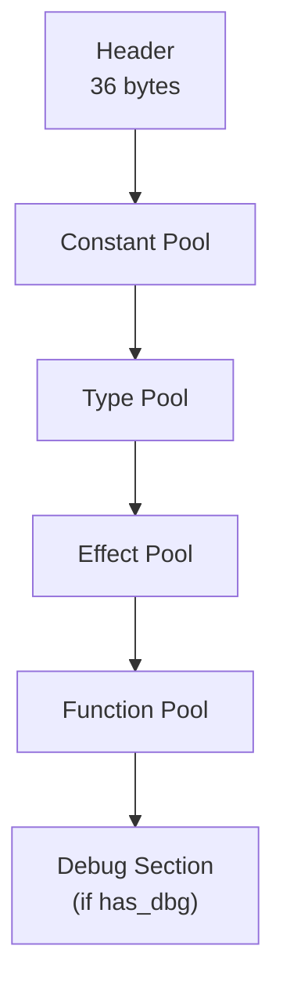

# §11 — Bytecode Format

All values little-endian. Extension `.msbc`.

## 11.1 File Structure



### Header (36 bytes)

```
0x00  u8[4]  magic        = { 4D 55 53 49 }  "MUSI"
0x04  u16    version_maj  = 1
0x06  u16    version_min  = 0
0x08  u32    flags
0x0C  u32    entry_point  fn_id, or 0xFFFFFFFF if library
0x10  u32    const_off
0x14  u32    type_off
0x18  u32    effect_off
0x1C  u32    fn_off
0x20  u32    checksum     CRC32 of [0x00, 0x20)
```

### Flags

| Bit | Meaning |
|-----|---------|
| 0 | `no_gc` |
| 1 | `has_dbg` |
| 2 | `is_lib` |
| 3 | `is_script` |
| 4–31 | reserved, zero |

## 11.2 Constant Pool

Header: `u32 count`. Entries indexed from 0.

| kind | tag | data |
|------|-----|------|
| i32 | 0x01 | s32 |
| i64 | 0x02 | s64 |
| f32 | 0x03 | IEEE 754 f32 |
| f64 | 0x04 | IEEE 754 f64 |
| str | 0x05 | u32 byte_len, utf8[] |
| rune | 0x06 | u32 codepoint |
| type | 0x07 | u32 type_id |
| fn | 0x08 | u32 fn_id |

## 11.3 Type Pool

Header: `u32 count`.

| kind | tag | data |
|------|-----|------|
| unit | 0x01 | — |
| bool | 0x02 | — |
| i8..i64 | 0x03..0x06 | — |
| u8..u64 | 0x07..0x0A | — |
| f32/f64 | 0x0B/0x0C | — |
| rune | 0x0D | — |
| ptr | 0x0E | u32 elem_type_id |
| arr | 0x0F | u32 elem_type_id |
| product | 0x10 | u32 field_count, u32[] field_type_ids |
| sum | 0x11 | u32 variant_count, variant_entry[] |
| fn | 0x12 | u32 param_count, u32[] param_type_ids, u32 ret_type_id, u16 effect_mask |
| ref | 0x13 | u32 inner_type_id |

`variant_entry`: `u32 tag_value`, `u32 payload_type_id` (0xFFFFFFFF = no payload).

Effect mask bits: `0=IO 1=Async 2=State 3=Unsafe 4=Manual 5=Throw 6=Control 7=Arena`.

## 11.4 Effect Pool

Header: `u32 count`. Variable-length entries:

```
u32  effect_id
u32  name_const_idx    // string in const pool
u16  op_count
effect_op_entry[]:
  u32  op_id
  u32  name_const_idx  // string in const pool
  u16  param_count
  u32[] param_type_ids // indexes into type pool
  u32  ret_type_id
```

## 11.5 Function Pool

Header: `u32 count`. Variable-length entries:

```
u32  fn_id
u32  type_id
u16  local_count    // params included
u16  param_count    // first N locals are params
u16  max_stack
u16  effect_mask
u32  code_len
u8[] code
u16  handler_count
handler_entry[]:
  u8   effect_id
  u32  handler_fn_id
```

## 11.6 Value Representation — Top-16 NaN-Boxing

All stack values are 64-bit words. Tag in the **top 16 bits**, payload in the **bottom 48 bits**.

```
bits 63..48   type tag (16 bits)
bits 47..0    payload (48 bits — fits x86-64 and ARM64 user-space addresses)
```

Tags `0x0000`–`0x7FF0` and `0xFFF0`–`0xFFFF` are used by IEEE 754 doubles (normal, subnormal, zero, NaN, infinity). MUSI uses tags in the range `0x7FF1`–`0x7FFA` for non-float values.

> **This is a top-tag scheme, not a bottom-tag scheme.** Do not assume `value & 0xF` gives the tag.

| tag | type | payload |
|-----|------|---------|
| 0x0000–0x7FF0 | float | IEEE 754 double |
| 0x7FF8 | float NaN | canonical quiet NaN |
| 0x7FF1 | int | signed 48-bit (sign-extended) |
| 0x7FF2 | uint | unsigned 48-bit |
| 0x7FF3 | bool | 0=false, 1=true |
| 0x7FF4 | rune | Unicode codepoint (21 bits) |
| 0x7FF5 | ref | GC heap pointer (48-bit address) |
| 0x7FF6 | ptr | raw pointer — Unsafe only |
| 0x7FF7 | fn | fn_id (32 bits) |
| 0x7FF8 | task | task handle |
| 0x7FF9 | chan | channel handle |
| 0x7FFA | unit | payload = 0 |

**48-bit integer range**: −2⁴⁷ to 2⁴⁷ − 1. Values outside this range require boxed `Int64`.

**ARM MTE / x86 LAM**: `pin` and `transmute` mask OS-level pointer tag bits before storing in the 48-bit payload.

## 11.7 Heap Object Layout

```
Header (8 bytes):
  type_id  : u32
  gc_flags : u8    // bit 0=marked, 1=tenured, 2=pinned, 3=has-finaliser
  padding  : u24

Payload:
  product  →  field_0..field_N           (each a 64-bit value word)
  sum      →  tag:u32, payload...
  array    →  length:u64, elem_0..elem_N
```

No vtable. No lock word. No hashcode. Type pool provides exact pointer map for GC.

## 11.8 Instruction Encoding

High two bits of opcode determine length:

```
0x00–0x3F   00   1 byte   no operand
0x40–0x7F   01   2 bytes  u8 operand
0x80–0xBF   10   3 bytes  u16 operand (LE)
0xC0–0xFF   11   5 bytes  u32 operand (LE)
```

`.un` variants always at `base + 1` (odd opcode = unsigned). Jump offsets relative to byte after instruction.

## 11.9 Opcode Table

```
// §0  Control / Stack                          (no operand)
0x00  nop               ( -- )
0x01  hlt               ( -- )          exit, top of stack = status
0x02  ret               ( val -- )
0x03  ret.u             ( -- )          return unit
0x04  unr               ( -- )          unreachable — UB if executed
0x05  brk               ( -- )          debug breakpoint
0x06  dup               ( a -- a a )
0x07  pop               ( a -- )
0x08  swp               ( a b -- b a )

// §1  Integer Arithmetic  (overflow wraps)     (no operand)
0x10  i.add             ( a b -- a+b )  signed
0x11  i.add.un          unsigned
0x12  i.sub             ( a b -- a-b )  signed
0x13  i.sub.un
0x14  i.mul             signed
0x15  i.mul.un
0x16  i.div             signed, truncates toward zero
0x17  i.div.un
0x18  i.rem             signed
0x19  i.rem.un
0x1A  i.neg             ( a -- -a )

// §2  Float Arithmetic  (IEEE 754)             (no operand)
0x20  f.add  0x21  f.sub  0x22  f.mul  0x23  f.div  0x24  f.rem
0x25  f.neg

// §3  Bitwise / Logical                       (no operand)
0x30  b.and             ( a b -- a and b )
0x31  b.or              ( a b -- a or b )
0x32  b.xor             ( a b -- a xor b )
0x33  b.not             ( a -- not a )
0x34  b.shl             ( a n -- a << n )
0x36  b.shr             ( a n -- a >> n )   arithmetic (sign-extend)
0x37  b.shr.un          ( a n -- a >>> n )  logical (zero-fill)

// §4  Equality                                (no operand)
0x3B  cmp.eq            ( a b -- Bool )
0x3C  cmp.ne

// §5  Locals / Constants / Structures         (u8 operand)
0x40  ld.loc    u8      ( -- val )      local slot[N]
0x41  st.loc    u8      ( val -- )
0x42  ld.cst    u8      ( -- val )      const_pool[N]
0x43  st.fld    u8      ( obj val -- )
0x44  mk.prd    u8      ( f0..fN -- )   make product, N fields
0x45  ld.fld    u8      ( prod -- val ) Nth field
0x46  mk.var    u8      ( payload -- )  make variant tag N
0x47  ld.pay    u8      ( var -- val )  Nth payload field
0x48  cmp.tag   u8      ( var -- Bool ) tag = N?
0x49  cnv.wdn   u8      signed widen to N bits
0x4A  cnv.wdn.un u8     unsigned widen
0x4B  cnv.nrw   u8      narrow (truncate)
0x4C  eff.psh   u8      push effect handler frame
0x4D  eff.pop   u8      pop effect handler frame

// §6  Ordered Comparison  (no operand, .un pairs)
0x50  cmp.lt    0x51  cmp.lt.un
0x52  cmp.le    0x53  cmp.le.un
0x54  cmp.gt    0x55  cmp.gt.un
0x56  cmp.ge    0x57  cmp.ge.un

// §7  Float Comparison  (NaN: ordered → false, cmp.fne → true)
0x58  cmp.feq  0x59  cmp.fne  0x5A  cmp.flt
0x5B  cmp.fle  0x5C  cmp.fgt  0x5D  cmp.fge

// §8  Conversion                              (no operand)
0x5E  cnv.itf            ( int -- float )
0x5F  cnv.fti            ( float -- int )  truncate toward zero
0x60  cnv.trm            ( a -- b )        transmute bits — Unsafe required

// §9  Structural / Array / Effects            (no operand)
0x61  ld.tag             ( var -- tag:u32 )
0x62  ld.len             ( arr -- len:i64 )
0x63  ld.idx             ( arr idx -- val )
0x64  st.idx             ( arr idx val -- )
0x65  fre                ( ptr -- )         Manual required
0x66  eff.res.c          ( val -- )         resume continuation (callee side)
0x67  eff.abt            ( err -- )         abort effect
0x68  tsk.awt            ( task -- val )    await task
0x69  inv.dyn   u8       ( callee args... -- ret )   indirect call; u8 = arg count

// §10  Wide Locals / Jumps  (u16 operand)
0x80  ld.loc.w  0x81  st.loc.w  0x82  ld.cst.w
0x83  st.fld.w  u16
0x84  mk.var.w  u16
0x85  cmp.tag.w u16
0x86  jmp       i16    unconditional
0x87  jmp.t     i16    jump if true
0x88  jmp.f     i16    jump if false

// §11  Invocation  (u32 operand)
0xC0  inv        u32    ( args -- ret )    pure
0xC1  inv.eff    u32    effectful
0xC2  inv.tal    u32    tail — reuses frame, O(1) stack
0xC3  inv.tal.eff u32   tail effectful

// §12  Globals / Allocation  (u32 operand)
0xC4  ld.glb    u32    0xC5  st.glb u32
0xC6  mk.arr    u32    ( len -- arr )
0xC7  alc.ref   u32    ( -- ref )    GC nursery
0xC8  alc.man   u32    ( -- ptr )    Manual required
0xC9  alc.arn   u32    ( -- ptr )    Arena required

// §13  Effects  (u32 operand)
0xCA  eff.do    u32    ( args -- ret )   perform effect op_id
0xCB  eff.res   u32    ( val -- )        resume (handler side)

// §14  Concurrency  (u32 operand)
0xCC  tsk.spn   u32    ( args -- task )
0xCD  tsk.chs   u32    ( val -- )        channel send
0xCE  tsk.chr   u32    ( -- val )        channel recv, suspends if empty
0xCF  tsk.cmk   u32    ( -- chan )        make channel

// §15  Wide Jumps  (u32 operand)
0xD0  jmp.w  u32    0xD1  jmp.t.w  u32    0xD2  jmp.f.w  u32

// Total: 75 opcodes
```
