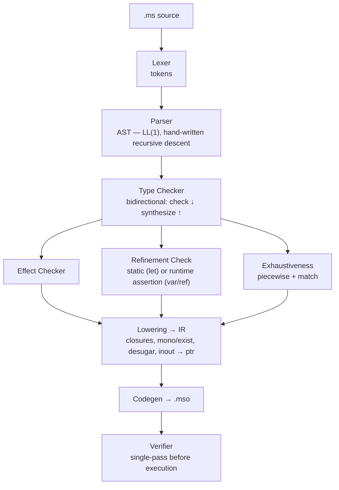
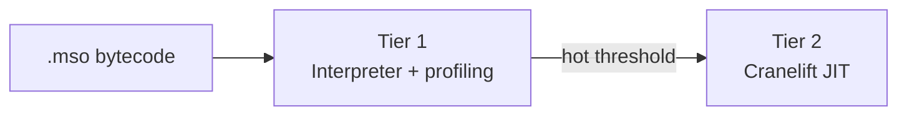
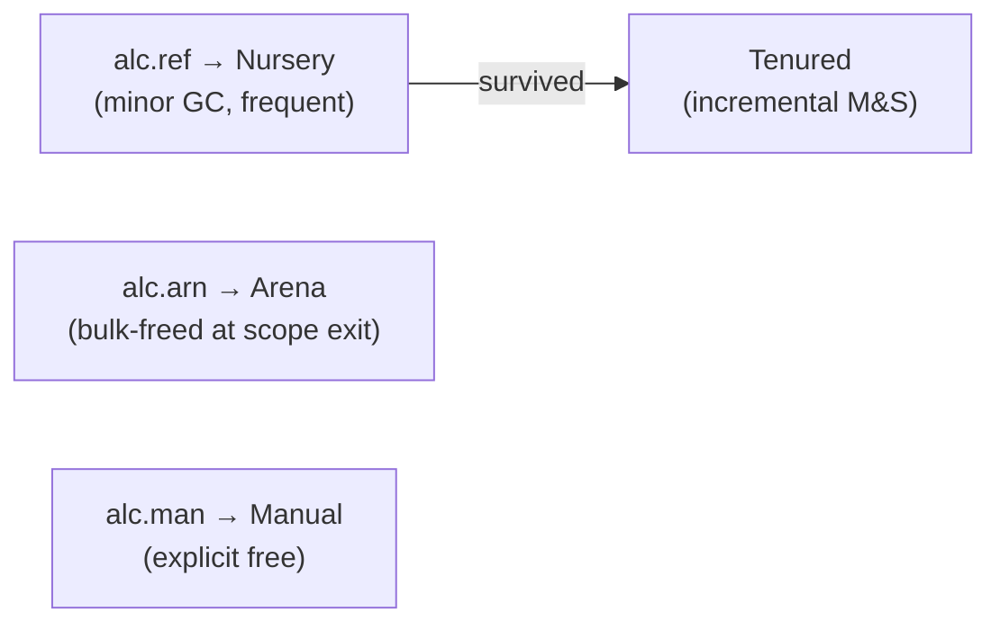

# §12 — VM & Compiler

## 12.1 Pipeline



## 12.2 JIT Path (future, Rust host only)



## 12.3 Frame Layout

```
Frame:
  locals   [slot_0 .. slot_N]    // size = local_count; slots 0..param_count-1 = params
  stack    [val_0 .. val_top]    // max depth = max_stack
  effects  [frame_0 ..]          // effect handler stack — linked list
  ip       instruction pointer
```

Remaining locals (after params) are zero-initialised on entry.

## 12.4 Value Representation

Top-16 NaN-boxing. Tag in bits 63..48. Payload in bits 47..0. See §11.5 for full table.

> Do not assume `value & 0xF` gives the tag. The tag is in the **top** 16 bits.

## 12.5 Heap Object Layout

```
Header (8 bytes):
  type_id  : u32
  gc_flags : u8    // bit 0=marked, 1=tenured, 2=pinned, 3=has-finaliser
  padding  : u24

Payload:
  product →  field_0..field_N       (64-bit value words)
  sum     →  tag:u32, payload...
  array   →  length:u64, elem_0..N
```

No vtable. No lock word. No hashcode. Precise GC — type pool gives exact pointer map.

## 12.6 Call Convention

| Step | Action |
|------|--------|
| Caller | Push args left-to-right, emit `inv`/`inv.eff` |
| Callee entry | Pop `param_count` values into slots 0..N-1; zero-init remaining; fresh stack |
| `ret` | Pop return value, push onto caller's stack |
| `ret.u` | Push unit onto caller's stack |
| `inv.tal` | Overwrite locals 0..N-1, reset ip — O(1) stack, frame reused |

`inout` parameters are resolved to pointer-passing before bytecode is emitted. No special calling convention needed.

## 12.7 Verifier

Single linear pass before execution. Rejects:

- Stack depth exceeding `max_stack` on any path
- Type inconsistency across instructions
- `cnv.trm` / `fre` / `alc.man` / `alc.arn` outside permitted `effect_mask`
- `inv.tal` not in tail position, or with pending defers in scope
- Jump targets on invalid instruction boundaries
- Any pool index out of bounds
- `eff.res.c` / `eff.abt` outside active effect handler scope
- Continuation used after resume (linear token — single-shot enforcement)

## 12.8 Effect Execution

```
EffFrame:
  effect_id  : u8
  handler_fn : fn_id
  saved_ip   : u32
  parent     : *EffFrame
```

`eff.do op_id`:

1. Walk handler stack for nearest matching `effect_id`
2. Capture current continuation (`ip` + stack state) as a linear value
3. Transfer to handler with continuation as first-class argument
4. No matching handler → trap (should be caught statically)

Handler may resume (`eff.res`) or abort (`eff.abt`). Continuation is single-shot — consumed on first use, dead thereafter.

### Source → bytecode mapping

| Source | Bytecode |
|--------|----------|
| `~> over { IO }` | `eff.psh 0x00` at entry |
| `await expr` | `eff.do Async.Suspend` |
| `spawn fn` | `tsk.spn fn_id` |
| `defer expr` | inserted before each `ret`/`ret.u`, LIFO |
| `Throw of 'E` | `eff.do Throw.Raise` |
| `try expr` | `inv Propagate.extract` |
| `inout` param | pointer-passing — no opcode |
| `var` binding | `st.loc`/`ld.loc` on mutable local |
| `ref` allocation | `alc.ref type_id` |

## 12.9 GC



- **Non-moving**: pointers stable across GC cycles.
- **Precise**: exact pointer map from type pool.
- **Incremental**: no stop-the-world pauses.
- **Write barrier**: `st.fld`/`st.idx` tenured→nursery stores mark card table. Nursery GC scans dirty cards as roots.

## 12.10 Compilation Examples

### Piecewise

```
// let fib := (n: Int) -> ( 0 if n = 0 | 1 if n = 1 | fib(n-1)+fib(n-2) if _ );

    ld.loc 0; ld.cst 0; cmp.eq; jmp.f .l1
    ld.cst 0; ret
.l1:
    ld.loc 0; ld.cst 1; cmp.eq; jmp.f .l2
    ld.cst 1; ret
.l2:
    ld.loc 0; ld.cst 1; i.sub; inv fib   // fib(n-1) — NOT inv.tal: result still needed
    ld.loc 0; ld.cst 2; i.sub; inv fib   // fib(n-2)
    i.add; ret
```

### Tail-recursive loop

```
// let sum := (acc n: Int) -> ( acc if n=0 | sum(acc+n, n-1) if _ );

    ld.loc 1; ld.cst 0; cmp.eq; jmp.f .rec
    ld.loc 0; ret
.rec:
    ld.loc 0; ld.loc 1; i.add   // acc + n
    ld.loc 1; ld.cst 1; i.sub   // n - 1
    inv.tal sum                  // O(1) stack — verifier guaranteed
```

### var mutation

```
// var x := 5; x <- 10; x <- x + 1;

    ld.cst 5;  st.loc 0       // initialise
    ld.cst 10; st.loc 0       // x <- 10
    ld.loc 0; ld.cst 1; i.add; st.loc 0  // x <- x + 1
```

`var`/`let` distinction is compile-time only. The VM has no concept of mutable locals.

## 12.11 Host Notes

### Rust (reference)

| Component | Approach |
|-----------|----------|
| Parser | Hand-written recursive descent |
| Interpreter | Top-16 NaN-boxing dispatch loop |
| JIT | Cranelift (future) |
| GC | Custom generational |
| Async | Green thread cooperative scheduler |
| FFI | `std::ffi`, `libc` |

### Conforming host requirements

1. Reads `.mso` per §11
2. Implements top-16 NaN-boxing value representation
3. Passes the verifier rules in §12.7
4. Exposes the C embedding API (§7.7)
