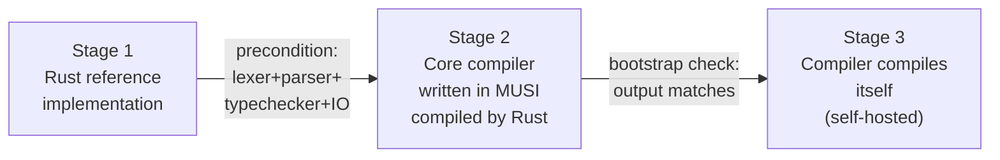

# §13 — Bootstrap

## 13.1 Strategy

Three-stage bootstrap. Rust is the trusted seed. Self-hosting is the target. The Rust implementation is never discarded — it remains the verifiable seed for future compiler versions.



## 13.2 Stage 1 — Rust Reference Implementation

Goal: correct, not fast.

| Step | Deliverable | Notes |
|------|-------------|-------|
| 1 | Lexer | Maximal munch, all token types, mandatory `;` |
| 2 | Parser | Recursive descent, LL(1), one fn per non-terminal |
| 3 | AST | Per §9 |
| 4 | Tree-walk interpreter | Skip codegen initially |
| 5 | Type checker | Bidirectional, inference + constraints, no refinements yet |
| 6 | Effect checker | All effects declared in signatures |
| 7 | GC | Nursery + tenured, non-moving, incremental |
| 8 | Bytecode codegen | Emit `.mso` per §11 |
| 9 | VM + verifier | Execute `.mso`, single-pass verifier per §12.7 |
| 10 | Stdlib core | `Option` `Result` `Eq` `Ord` `Into` `Iterable` `Propagate` |

**Deferred to Stage 2**: static refinement checking, Arena effect, JIT, full FFI surface.

## 13.3 Stage 2 — Compiler in MUSI

Write in order — each is a testable unit. Compile with Rust, run against Rust interpreter to verify.

1. Lexer — pure transformation, easy to test
2. Parser — stress-tests ADTs, pattern matching, piecewise
3. AST + type representations — stress-tests modules and typeclasses
4. Type checker — hardest; do last in this stage

## 13.4 Stage 3 — Self-Hosting

1. Port remaining phases to MUSI
2. Compile MUSI compiler with the Rust-compiled MUSI compiler
3. Verify output compiles itself identically (bootstrap check)
4. Rust implementation becomes the seed — retained, not the primary path

## 13.5 Refinement Types — Deferred Path

| Phase | Behaviour |
|-------|-----------|
| Stage 1–2 | Runtime assertions only — `{ n: Int \| n > 0 }` inserts a check at construction |
| Post-bootstrap | Liquid type checking: decidable fragment (linear arithmetic, array lengths, inequalities) backed by SMT or abstract interpretation |

Predicates outside the decidable fragment remain runtime-checked permanently.

## 13.6 Memory Implementation Order

| Phase | What |
|-------|------|
| Stage 1 early | GC only — nursery + tenured |
| Stage 1 late | `Manual` effect + `alc`/`free` + boundary rules |
| Post-Stage 1 | `Arena` effect |
| Last | `--no-gc` flag — requires all three memory systems stable |

## 13.7 Milestones

```
M1   Hello world (tree-walk interpreter)
M2   Fibonacci, sum — tail calls O(1), verifier passes
M3   Bytecode emitted and executed
M4   Stdlib core complete
M5   Lexer in MUSI, compiled by Rust, output matches
M6   Parser in MUSI
M7   Full compiler in MUSI, compiled by Rust
M8   Compiler compiles itself — bootstrap complete
```

## 13.8 Risk Register

| Risk | Mitigation |
|------|------------|
| Refinement checking undecidable for arbitrary predicates | Restrict to liquid fragment; runtime-check the rest |
| Single-shot continuation enforcement | Linear token; verifier marks consumed on `eff.res`/`eff.abt` |
| Mutual tail recursion detection | Track call graph during lowering; `inv.tal` only where verified safe |
| Arena pointer escape | Lifetime region inference or explicit scope tags |
| Module naming collision | `#[module := "Name"]` override escape hatch |
| `inout` pointer aliasing | Two `inout` params pointing to the same location is UB — document as precondition |
