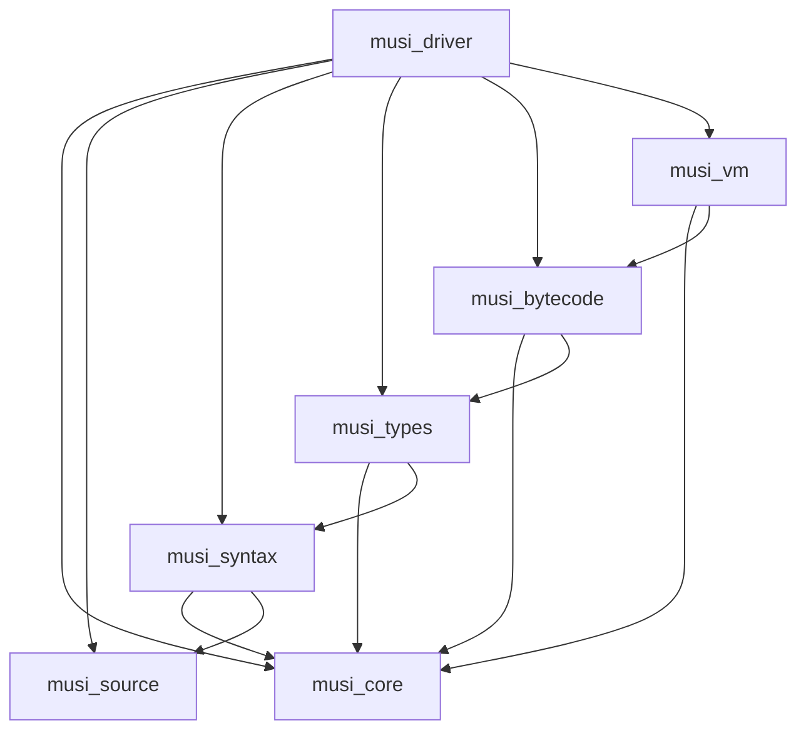

# Musi Compiler Architecture

## Abstract

Musi is a statically-typed systems programming language with gradual typing semantics, compiling to stack-based bytecode (MSIL) for the Musi Virtual Machine. The compiler employs a 7-layer architecture with strict dependency ordering and clear phase separation.

## 1. Architectural Principles

### 1.1 Layer Ordering

The compiler enforces strict layer dependencies:

```text
Layer 1 → Layer 2 → Layer 3 → Layer 4 → Layer 5
   ↓        ↓         ↓         ↓         ↓
Layer 6 → Layer 7 (Driver)
```

No circular dependencies permitted. Each layer exports a stable interface to higher layers and consumes only from lower layers.

### 1.2 Embeddability Constraint

The runtime (Layer 5) must be embeddable in foreign-language hosts without compiler dependencies. Layer 5 may depend only on Layer 1.

### 1.3 Phase Purity

Each compilation phase performs a single transformation:

- Lexical analysis → Token stream
- Syntactic analysis → Abstract syntax tree
- Semantic analysis → Typed tree
- Bytecode emission → MSIL module

### 1.4 Arena Allocation

All intermediate representations use arena allocation with typed node identifiers. Heap allocation is prohibited for AST nodes.

## 2. Layer Specifications

### Layer 1: musi_core

**Responsibility**: Foundation primitives and utilities.

**Exports**:

- `Arena<T>`: Region-based allocator
- `OpaqueIdent<T>`: Typed opaque identifiers
- `Span`: Source code position range
- `InternIdent`: Interned string identifier
- `Interner`: String interning facility
- `MusiError`: Base error type

**Dependencies**: `std` only
**Size**: ~500-800 lines
**Rationale**: Pure infrastructure; no language-specific concepts.

---

### Layer 2: musi_source

**Responsibility**: Source file management and position tracking.

**Exports**:

- `SourceFile`: Single source buffer with line tracking
- `SourceMap`: Collection of source files

**Dependencies**: `musi_core`
**Size**: ~100-150 lines
**Rationale**: Separated for reuse in diagnostics and LSP.

---

### Layer 3: musi_syntax

**Responsibility**: Lexical and syntactic analysis; AST construction.

**Exports**:

- `TokenKind`, `Token`: Lexical tokens with spans
- `Expr`, `Stmt`, `Pat`, `TyExpr`: AST nodes
- `NodeArena`: Node storage and traversal
- `parse(source: &str) -> MusiResult<Ast>`

**Key Design Decisions**:

1. Syntax definitions are expressions: `val foo := () => 42` is a value binding
2. No separate top-level declaration grammar: `prog = {stmt}`
3. Arena-allocated with typed identifiers for O(1) node access

**Dependencies**: `musi_core`, `musi_source`
**Size**: ~2500-3000 lines
**Rationale**: Lexer, parser, and AST are co-dependent; merging eliminates import cycles.

---

### Layer 4: musi_types

**Responsibility**: Type system and bidirectional inference.

**Exports**:

- `Ty`, `TyKind`: Semantic types (not AST type expressions)
- `TyArena`: Type node storage
- `Inferer`: Bidirectional inference engine
- `Unifier`: Union-find unification

**Type Semantics**:

```text
TyKind ::= Any | Never | Int | Real | String | Bool | Rune
         | Tuple(Vec<TyId>) | Array(TyId) | Optional(TyId)
         | Fn { params: Vec<TyId>, ret: TyId }
         | Record { name: Name, fields: Vec<(Name, TyId)> }
         | Choice { name: Name, variants: Vec<(Name, Vec<TyId>)> }
         | Typeclass { name: Name, ty_params: Vec<TyId>, constraints: Vec<Constraint>, methods: Vec<Method> }
         | Instance { typeclass: Name, ty_args: Vec<TyId>, impl_for: TyId }
```

Gradual typing: Unannotated expressions default to `Any` (top type) unless `noImplicitAny` is enabled.

**Dependencies**: `musi_core`, `musi_syntax`
**Size**: ~2000-2500 lines
**Rationale**: Type system is standalone and reusable; separation enables testing without parsing.

---

### Layer 5: musi_bytecode

**Responsibility**: MSIL bytecode emission and optimization.

**Exports**:

- `BytecodeModule`: Compiled module with constant pool and symbol table
- `InstrSet`: Bytecode instruction set
- `EmitterContext`: Emission state and utilities
- `emit(ast: &TypedAst) -> BytecodeModule`

**Optimizations** (peephole, AST-level):

- Constant folding of arithmetic expressions
- Dead code elimination (post-emit)
- Jump threading for control flow

**Dependencies**: `musi_core`, `musi_types`
**Size**: ~1500-2000 lines
**Rationale**: Bytecode representation and emission are tightly coupled.

---

### Layer 6: musi_vm

**Responsibility**: Stack-based virtual machine execution.

**Exports**:

- `Vm`: Interpreter with call stack and heap
- `Value`: Tagged union for VM values
- `Frame`: Activation record
- `exec(module: &BytecodeModule) -> MusiResult<Value>`

**Foreign Function Interface** (C-compatible):

```c
MusiVM* musi_vm_create(void);
int musi_vm_load_bytecode(MusiVM* vm, const uint8_t* data, size_t len);
int musi_vm_run(MusiVM* vm);
MusiValue musi_vm_call_function(MusiVM* vm, const char* name, ...);
```

**Dependencies**: `musi_core`, `musi_bytecode`
**Size**: ~1500-2500 lines
**Rationale**: Embeddable runtime; minimal dependencies ensure host language independence.

---

### Layer 7: musi_driver

**Responsibility**: Compiler driver, LSP server, and tooling.

**Components**:

- `musi_cli`: Command-line compiler (`musi source.musi → source.mso`)
- `musi_lsp`: Language server protocol implementation

**Features**:

- Check-only mode: Parse → typecheck, no emission
- Emit-asm mode: Generate bytecode listing
- Incremental compilation support (future)

**Dependencies**: All layers (makes driver monolithic but practical)
**Size**: ~800-1200 lines
**Rationale**: Entry point for both batch compilation (CLI) and interactive development (LSP).

## 3. Dependency Graph



**Embeddability**: Dotted line separates compiler (Layers 1-5) from runtime (Layer 6). Layer 6 has no dependency on Layers 2-4.

## 4. Design Constraints

### 4.1 Identifier Model

All identifiers are interned via `Interner`. String data never duplicated; `Name` is a 32-bit integer.

### 4.2 Error Propagation

All layers return `Result<T, MusiError>` (MusiError). Diagnostic rendering occurs only in Layer 7.

### 4.3 Test Organization

- Unit tests: `src/module/tests.rs` within each crate
- Integration tests: `tests/` directory per crate
- Cross-layer tests: Layer 7 only

### 4.4 File Naming

Layer crates use `musi_` prefix. Output files: `.musi` (source) → `.mso` (bytecode).

## 5. Implementation Phases

**Phase 1**: Layers 1, 2, 3 (lexing and parsing)
**Phase 2**: Layer 4 (type system)
**Phase 3**: Layer 5 (bytecode emission)
**Phase 4**: Layer 6 (VM execution)
**Phase 5**: Layer 7 (driver and LSP)

## References

- [BYTECODE.md](./BYTECODE.md): MSIL instruction set specification
- [RUNTIME.md](./RUNTIME.md): Virtual machine architecture
- [LANGUAGE.md](./LANGUAGE.md): Source language specification
