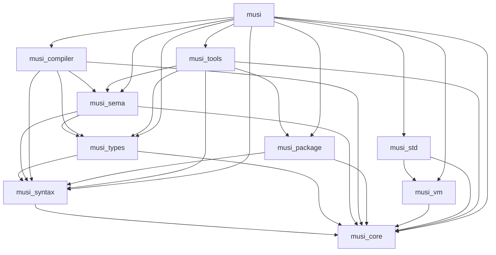

# Musi Compiler & Runtime Architecture

## Abstract

Musi is a statically-typed systems programming language with TypeScript-like gradual typing semantics, interpreted at runtime with ECMAScript-style module system. Source files execute directly without main entry points. Bytecode compilation produces bundles for distribution. The language employs a 10-crate consolidated architecture with strict dependency ordering, clear phase separation, and practical crate boundaries to avoid excessive fragmentation while maintaining embeddability.

## 1. Architectural Principles

### 1.1 Layer Ordering

The compiler enforces strict layer dependencies with no circular dependencies permitted:

```text
Layer 1 → Layer 2 → Layer 3 → Layer 4 → Layer 5
   ↓        ↓         ↓         ↓         ↓
Layer 6 → Layer 7 → Layer 8 → Layer 9 → Layer 10 (Driver)
```

Each layer exports a stable interface to higher layers and consumes only from lower layers.

### 1.2 Embeddability Constraint

The runtime (Layer 7: `musi_vm`) must be embeddable in foreign-language hosts without compiler dependencies. It may depend only on Layer 1.

### 1.3 Type System Design

- **TypeScript-like gradual typing** with `Any` (top type) and `Never` (bottom type)
- **Structural subtyping** for records
- **Local bidirectional inference** using union-find data structures
- **Circular dependency detection** at both type and module levels

### 1.4 Arena Allocation

All intermediate representations use arena allocation with typed node identifiers. Heap allocation is prohibited for AST nodes.

### 1.5 Consolidation Philosophy

Crate boundaries prioritize practical separation over excessive granularity. Related concerns are consolidated to reduce dependency management overhead while maintaining clear architectural layers.

## 2. Crate Specifications

### Layer 1: musi_core

**Responsibility**: Foundation primitives and utilities.

**Dependencies**: `std` only
**Rationale**: Pure infrastructure; no language-specific concepts.

---

### Layer 2: musi_syntax

**Responsibility**: Lexical and syntactic analysis; AST construction.

**Key Design Decisions**:

1. Lexer, parser, and AST are merged into single crate to eliminate import cycles
2. Syntax definitions are expressions: `val foo := () => 42` is a value binding
3. No separate top-level declaration grammar: `prog = {stmt}`
4. Arena-allocated with typed identifiers for O(1) node access

**Dependencies**: `musi_core`
**Rationale**: Lexer, parser, and AST are co-dependent; merging eliminates import cycles and reduces crate count.

---

### Layer 3: musi_types

**Responsibility**: Type definitions, subtyping relations, and type operations.

**Type Semantics**:

```text
TyKind ::= Any | Never | Int | Real | String | Bool | Rune
         | Tuple(Vec<TyId>) | Array(TyId) | Optional(TyId)
         | Fn { params: Vec<TyId>, ret: TyId }
         | Record { name: Name, fields: Vec<(Name, TyId)> }
         | Choice { name: Name, variants: Vec<(Name, Vec<TyId>)> }
```

**Type Hierarchy**:

- `Any`: Top type - all types are subtypes of Any
- `Never`: Bottom type - Never is subtype of all types
- User-defined types (records, choices) use structural subtyping

**Dependencies**: `musi_core`, `musi_syntax`
**Rationale**: Type system is standalone and reusable; separation enables testing without full parsing pipeline.

---

### Layer 4: musi_sema

**Responsibility**: Semantic analysis, type checking, and constraint solving.

**Key Design Decisions**:

1. Local bidirectional inference - no global Hindley-Milner inference
2. Union-find for type variable unification
3. Type narrowing for `match` expressions and conditional bindings
4. Circular dependency detection for types and values

**Dependencies**: `musi_core`, `musi_syntax`, `musi_types`
**Rationale**: Semantic analysis depends on both syntax (AST) and type system definitions.

---

### Layer 5: musi_compiler

**Responsibility**: Bytecode bundling, module linking, and distribution packaging.

**Key Design Decisions**:

1. AST to bytecode translation (see BYTECODE.md)
2. Module linking for ECMAScript-style imports
3. Bytecode bundle generation for distribution
4. Build orchestration for multi-module projects

**Dependencies**: `musi_core`, `musi_syntax`, `musi_types`, `musi_sema`
**Rationale**: Bundling phase depends on all previous phases; consolidation simplifies dependency management. Compilation produces bytecode bundles for distribution, not native code.

---

### Layer 6: musi_package

**Responsibility**: Package configuration, module resolution, and dependency management.

**Key Design Decisions**:

1. ES6-style import/export system (see grammar.ebnf)
2. Package configuration format (see mspackage-schema.v1.json)
3. Module resolution with path aliases and import maps
4. Dependency resolution with semantic versioning

**Dependencies**: `musi_core`, `musi_syntax`
**Rationale**: Package system is foundational for both compilation and tooling; minimal dependencies ensure reusability.

---

### Layer 7: musi_vm

**Responsibility**: Stack-based bytecode interpreter and runtime execution engine.

**Foreign Function Interface** (C-compatible):

```c
MusiVM* musi_vm_create(void);
void musi_vm_destroy(MusiVM* vm);
int musi_vm_load_bytecode(MusiVM* vm, const uint8_t* data, size_t len);
int musi_vm_run(MusiVM* vm);
MusiValue musi_vm_call_function(MusiVM* vm, const char* name, ...);
```

**Dependencies**: `musi_core`
**Rationale**: Embeddable runtime interpreter; minimal dependencies ensure host language independence. Executes bytecode bundles produced by musi_compiler.

---

### Layer 8: musi_std

**Responsibility**: Runtime standard library and foreign function interface.

**Key Design Decisions**:

1. Standard library written in Musi where possible
2. FFI module for C interop (similar to Rust std::ffi)
3. System bindings for platform-specific operations
4. `prelude.ms` imported implicitly (like Rust prelude)
5. Other std items require explicit import (like Rust std::io, std::fs)

**Dependencies**: `musi_core`, `musi_vm`
**Rationale**: Runtime standard library depends on VM for execution; FFI is integrated into stdlib rather than separate crate.

---

### Layer 9: musi_tools

**Responsibility**: Formatter, linter, testing, documentation, and workspace management.

**Key Design Decisions**:

1. Formatter and linter share syntax analysis infrastructure
2. Testing framework integrates with package system
3. Workspace manages multi-package projects
4. Task runner supports dependency-based task execution

**Dependencies**: `musi_core`, `musi_syntax`, `musi_types`, `musi_sema`, `musi_package`
**Rationale**: Tools depend on all compilation phases; consolidation reduces duplicate infrastructure.

---

### Layer 10: musi

**Responsibility**: Command-line interface runtime driver and language server.

**Runtime Model**: Musi is an interpreted language with ECMAScript-style module system. Files are modules without main entry points - executed directly like JavaScript/Deno/Bun scripts. Compilation produces bytecode bundles for distribution, but source execution is the primary workflow.

**Subcommands** (Deno/Bun runtime-style):

- `musi run`: Execute source file or script (primary command)
- `musi check`: Type-check without execution
- `musi compile`: Compile source to bytecode bundle for distribution
- `musi bundle`: Bundle modules into single bytecode file
- `musi fmt`: Format source code
- `musi lint`: Lint source code
- `musi test`: Run tests
- `musi bench`: Run benchmarks
- `musi init`: Initialize new project
- `musi install`: Install dependency
- `musi add`: Add dependency
- `musi remove`: Remove dependency
- `musi cache`: Cache dependencies
- `musi eval`: Evaluate inline script
- `musi repl`: Interactive REPL
- `musi lsp`: Start language server

**Dependencies**: All layers (makes driver monolithic but practical)
**Rationale**: Entry point for both runtime execution (CLI) and interactive development (LSP). Single binary provides unified user experience like Deno/Bun.

---

## 3. Dependency Graph



**Embeddability**: Dotted line separates compiler layers (1-5) from runtime (7). Layer 7 has no dependency on layers 2-5.

## 4. Design Constraints

### 4.1 Identifier Model

All identifiers are interned via `Interner`. String data never duplicated; `Name` is a 32-bit integer.

### 4.2 Error Propagation

All layers return `Result<T, MusiError>`. Diagnostic rendering occurs only in Layer 10.

### 4.3 Test Organization

- Unit tests: `src/module/tests.rs` within each crate
- Integration tests: `tests/` directory at workspace root
- Cross-layer tests: Layer 10 only

### 4.4 File Naming

Crate names use `musi_` prefix. Output files: `.ms` (source) → `.mso` (bytecode).

### 4.5 Crate Count Constraint

Maximum of 10 crates to avoid excessive fragmentation. Consolidation preferred over splitting.

## 5. Implementation Phases

**Phase 1**: Layers 1, 2 (core infrastructure, syntax)
**Phase 2**: Layers 3, 4 (type system, semantic analysis)
**Phase 3**: Layer 5 (compilation, bytecode emission)
**Phase 4**: Layer 6 (package system, module resolution)
**Phase 5**: Layer 7 (VM execution, module loading)
**Phase 6**: Layer 8 (standard library)
**Phase 7**: Layer 9 (tools: formatter, linter, testing)
**Phase 8**: Layer 10 (CLI driver, LSP server)

## 6. Future Internal Module Structure

Internal module organization for each crate is deferred to future discussion. Each crate may contain submodules as implementation details, but must maintain stable public APIs.

Module structure decisions will consider:

- File organization patterns (e.g., `file.rs` + `file/tests.rs`)
- Test helper placement
- Public vs private module boundaries
- Feature flag organization

This section will be updated after crate consolidation is complete.

## References

- [BYTECODE.md](./BYTECODE.md): MSIL instruction set specification
- [RUNTIME.md](./RUNTIME.md): Virtual machine architecture
- [LANGUAGE.md](./LANGUAGE.md): Source language specification
- [mspackage-schema.v1.json](../schemas/mspackage-schema.v1.json): Package configuration schema
- [grammar.ebnf](../grammar.ebnf): Source language grammar
