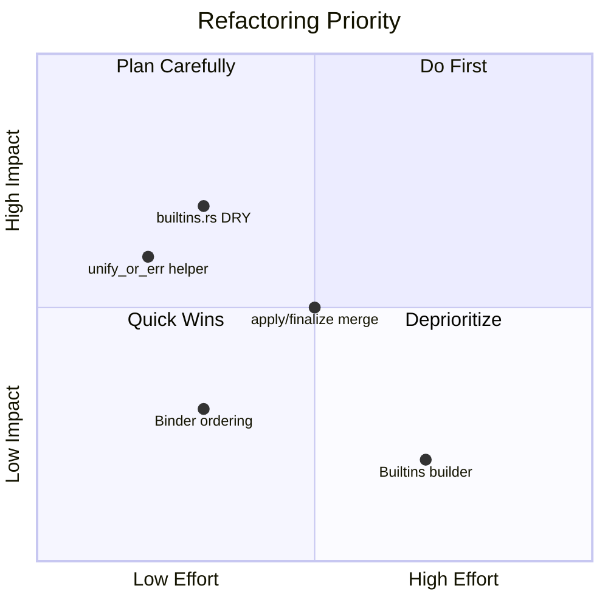

# musi_sema Code Style & Refactoring Analysis

> Analysis of the `musi_sema` crate for code style consistency, Rust item ordering, and DRY/KISS/SRP principle compliance.

---

## Executive Summary

The `musi_sema` crate (10 files, ~1,800 lines) is well-structured overall, but contains several opportunities for improvement in code organization, deduplication, and adherence to project conventions.

| Category | Issues Found | Priority |
|----------|--------------|----------|
| **DRY Violations** | 4 significant | High |
| **Item Ordering** | 3 inconsistencies | Medium |
| **KISS Concerns** | 2 opportunities | Low |
| **SRP Concerns** | 1 potential issue | Medium |

---

## 1. DRY Violations (Don't Repeat Yourself)

### 1.1 `builtins.rs`: Repetitive Registration Code

**File**: [builtins.rs](file:///Users/krystian/CodeProjects/musi/crates/musi_sema/src/builtins.rs#L67-L196)

**Issue**: The `register()` method contains 16 nearly identical blocks (~130 lines) for defining builtin types. Each block follows the exact same pattern:

```rust
let _ = symbols
    .define(
        self.<field>,
        SymbolKind::Builtin,
        TyRepr::<factory>(<args>),
        span,
        false,
    )
    .expect("builtin already defined");
```

**Recommendation**: Use a data-driven approach with a helper method:

```rust
fn define_builtin(symbols: &mut SymbolTable, name: Ident, ty: TyRepr, span: Span) {
    let _ = symbols
        .define(name, SymbolKind::Builtin, ty, span, false)
        .expect("builtin already defined");
}

// In register():
let builtins = [
    (self.int8, TyRepr::int(IntWidth::I8)),
    (self.int16, TyRepr::int(IntWidth::I16)),
    // ...
];
for (name, ty) in builtins {
    define_builtin(symbols, name, ty, span);
}
```

**Impact**: ~100 lines reduced to ~20 lines.

---

### 1.2 `model.rs`: Identical Getter/Setter Patterns

**File**: [model.rs](file:///Users/krystian/CodeProjects/musi/crates/musi_sema/src/model.rs)

**Issue**: The file has 6 getter/setter pairs with identical structure for `expr_types`, `expr_symbols`, `pat_types`, `pat_symbols`, `ty_expr_types`.

**Verdict**: **Keep as-is.** While repetitive, custom macros are prohibited (hard to debug/reason about). The explicit methods are clear and IDE-friendly.

---

### 1.3 `unifier.rs`: `apply` vs `finalize_inner` Duplication

**Files**: [unifier.rs](file:///Users/krystian/CodeProjects/musi/crates/musi_sema/src/unifier.rs#L138-L191)

**Issue**: `Unifier::apply()` (L138-161) and `finalize_inner()` (L174-191) have nearly identical recursive structure:

```diff
// apply()                           | // finalize_inner()
match &ty.kind {                     | match &ty.kind {
  TyReprKind::Var(id) => ...         |   TyReprKind::Var(_) => TyRepr::error()
  TyReprKind::Optional(inner) =>     |   TyReprKind::Optional(inner) =>
    TyRepr::optional(self.apply(...))  |     TyRepr::optional(finalize_inner(...))
  // ... same structure for all ...  |   // ... same structure for all ...
}                                    | }
```

**Recommendation**: Use a visitor/transformer pattern or parameterize the transformation:

```rust
fn transform_ty(&self, ty: &TyRepr, var_handler: impl Fn(TyVarId) -> TyRepr) -> TyRepr {
    match &ty.kind {
        TyReprKind::Var(id) => var_handler(*id),
        TyReprKind::Optional(inner) => TyRepr::optional(self.transform_ty(inner, &var_handler)),
        // ... other cases
    }
}
```

**Impact**: ~40 lines merged into ~25, single maintenance point.

---

### 1.4 `binder.rs`: Repeated Unify + Error Pattern

**File**: [binder.rs](file:///Users/krystian/CodeProjects/musi/crates/musi_sema/src/binder.rs)

**Issue**: The pattern `if let Err(err) = self.unifier.unify(...) { self.error(err, span); }` appears **10+ times**:

- L168-171, L197-200, L215-218, L225-228, L236-239, L250-253
- L326-329, L361-364, L365-368, L377-380, L392-394, L417-420

**Recommendation**: Extract into a helper method:

```rust
fn unify_or_err(&mut self, a: &TyRepr, b: &TyRepr, span: Span) {
    if let Err(err) = self.unifier.unify(a, b) {
        self.error(err, span);
    }
}
```

**Impact**: Cleaner code, ~30 lines saved, consistent error handling.

---

## 2. Item Ordering Violations (per Agent Rules)

Per [02-stack.md](file:///Users/krystian/CodeProjects/musi/.agent/rules/02-stack.md#L11-L20), the ordering should be:

1. Constructors (`new`, `Default`, `From`)
2. Main public entry points
3. High-level orchestrators/dispatchers
4. Specialized implementation methods
5. Internal private helpers
6. Low-level navigation
7. Character predicates/unit helpers

### 2.1 `Binder` impl Block Ordering

**File**: [binder.rs](file:///Users/krystian/CodeProjects/musi/crates/musi_sema/src/binder.rs#L41-L568)

**Current Order**:

1. `new` ✅
2. `finish` ✅ (public entry point adjacent to constructor)
3. `bind_prog` ✅
4. `bind_stmt` ✅
5. `bind_expr` ✅
6. `bind_expr_inner` ⚠️ (dispatcher - should be before specific handlers)
7. `bind_expr_lit` through `bind_expr_fn` ✅
8. `bind_pat` ✅
9. `resolve_ty_expr`, `resolve_ty_expr_inner` ✅
10. `finalize_types` ⚠️ (should be with orchestrators, not at end)
11. `error` ⚠️ (low-level helper at end - correct)
12. `lookup_name` ⚠️ (low-level helper at end - correct)

**Recommended Changes**:

- Move `finalize_types` (L547-555) after `bind_prog` (orchestration phase)
- Group: `new` → `finish` → `bind_prog` → `finalize_types` → dispatchers → handlers → helpers

---

### 2.2 `Unifier` impl Block Ordering

**File**: [unifier.rs](file:///Users/krystian/CodeProjects/musi/crates/musi_sema/src/unifier.rs#L18-L171)

**Current Order**:

1. `new` ✅
2. `fresh_var` ⚠️ (factory method, should be with constructor)
3. `unify` ✅ (main API)
4. `apply` ✅
5. `finalize` ✅
6. `bind` ⚠️ (private helper at end - correct)

**Recommended Minor Adjustment**:

- Order is mostly correct; `fresh_var` fits as constructor-adjacent

---

### 2.3 `SymbolTable` impl Block Ordering

**File**: [symbol.rs](file:///Users/krystian/CodeProjects/musi/crates/musi_sema/src/symbol.rs#L128-L234)

**Current Order**:

1. `new` ✅
2. `curr_scope_id` ⚠️ (accessor should be lower)
3. `push_scope` ✅ (main API)
4. `pop_scope` ✅
5. `define` ✅ (main API)
6. `lookup` ✅
7. `lookup_local` ✅
8. `get`, `get_mut` ✅ (accessors)
9. `len`, `is_empty` ✅ (accessors)
10. `next_symbol_id` ✅ (private helper at end)

**Ordering is correct** ✅

---

## 3. KISS Violations (Keep It Simple, Stupid)

### 3.1 `TyRepr` Factory Method Proliferation

**File**: [ty_repr.rs](file:///Users/krystian/CodeProjects/musi/crates/musi_sema/src/ty_repr.rs#L61-L172)

**Issue**: 17 factory methods for constructing `TyRepr`:

- `unit()`, `bool()`, `never()`, `any()`, `unknown()`, `error()`, `string()`, `rune()`
- `int(width)`, `nat(width)`, `float(width)`, `var(id)`
- `optional(inner)`, `ptr(inner)`, `array(elem, size)`, `tuple(elems)`, `func(params, ret)`

**Analysis**: While each is individually simple, the proliferation adds API surface. However, this is **acceptable** because:

- Each maps 1:1 to a `TyReprKind` variant
- They improve ergonomics at call sites
- `TyRepr::new(TyReprKind::...)` is always available as an escape hatch

**Verdict**: **No change recommended** - this is idiomatic Rust for sum types.

---

### 3.2 `Builtins` Struct Construction (F#-ish Approach)

**File**: [builtins.rs](file:///Users/krystian/CodeProjects/musi/crates/musi_sema/src/builtins.rs#L7-L24)

**Issue**: 16 fields with a 16-parameter constructor. Callers must manually intern each name.

**Context**: These are **compiler-intrinsic record types** (`Any`, `Int8`, `Int`, etc.). The STL will define additional intrinsics later—codegen implications TBD.

**Recommendation**: F#-ish approach — `Builtins` owns its construction from interner:

```rust
impl Builtins {
    /// Creates builtins by interning all primitive type names.
    pub fn from_interner(interner: &mut Interner) -> Self {
        Self {
            int8: interner.intern("Int8"),
            int16: interner.intern("Int16"),
            int32: interner.intern("Int"),  // Int is the default based on CPU size
            // ... rest follow the pattern
        }
    }
}
```

**Benefits**:

- Single source of truth for builtin names
- Caller just passes `&mut Interner`, no manual interning
- Easy to add new builtins (one place)
- Names are co-located with the struct definition

**Impact**: Eliminates 16-arg constructor, simplifies all call sites (e.g., `tests.rs`).

> [!NOTE]
> **Platform-Sized Types**: `Int`, `Nat`, `Float` (unsuffixed) are platform-dependent:
>
> - 64-bit system: `Int` = `Int64`, `Float` = `Float64`
> - 32-bit system: `Int` = `Int32`, `Float` = `Float32`
>
> Consider a Rust type alias using `cfg` attributes:
>
> ```rust
> #[cfg(target_pointer_width = "64")]
> pub type FSize = f64;
> #[cfg(target_pointer_width = "32")]
> pub type FSize = f32;
> ```
>
> This can inform `TyRepr` construction for platform-sized Musi types.

---

## 4. SRP Violations (Single Responsibility Principle)

### 4.1 `Binder` Struct Responsibilities

**File**: [binder.rs](file:///Users/krystian/CodeProjects/musi/crates/musi_sema/src/binder.rs#L30-L39)

**Current Responsibilities**:

1. Type inference and checking
2. Symbol table management (push/pop scope, lookup)
3. Error/diagnostic collection
4. Semantic model population
5. Context tracking (`in_loop`, `in_fn`)

**Analysis**: This is a **borderline case**. In compilers, the "binder" often encompasses all of these as they are tightly coupled during a single pass. Splitting would require:

- Passing many parameters between components
- Complex coordination

**Verdict**: **No change recommended** for now. If the struct grows further, consider extracting:

- A `BinderContext` for state flags
- A `DiagnosticEmitter` trait

---

## 5. Code Style Observations

### 5.1 Consistent Patterns ✅

- All files use `#[must_use]` appropriately
- Doc comments with `///` follow Rust conventions
- `#[allow(...)]` attrs are used judiciously

### 5.2 Minor Style Suggestions

| Location | Suggestion |
|----------|------------|
| [lib.rs:16-18](file:///Users/krystian/CodeProjects/musi/crates/musi_sema/src/lib.rs#L16-L18) | Glob re-exports (`pub use symbol::*`) can obscure API surface. Consider explicit re-exports. |
| [types.rs](file:///Users/krystian/CodeProjects/musi/crates/musi_sema/src/types.rs) | File is only type aliases (12 lines). Could be merged into `ty_repr.rs` or kept as-is for clarity. |

---

## 6. Refactoring Priority Matrix



---

## 7. Recommended Action Items

### High Priority

1. **Extract `unify_or_err` helper** in `binder.rs` (~10 min)
2. **Refactor `builtins.rs::register()`** with helper method (~20 min)

### Medium Priority

1. **Merge `apply`/`finalize_inner`** in `unifier.rs` (~30 min)
2. **Reorder `Binder` impl block** per agent rules (~15 min)

### Low Priority (Consider Later)

1. **Evaluate glob re-exports** in `lib.rs` (style preference)

---

## 8. Testing Notes

Existing tests in [tests.rs](file:///Users/krystian/CodeProjects/musi/crates/musi_sema/src/tests.rs):

- 4 unifier tests
- 8 binder tests

**Run command**:

```bash
cargo test -p musi_sema
```

Any refactoring should ensure all tests pass. The tests have good coverage for core functionality.

---

## Appendix: File Summary

| File | Lines | Purpose |
|------|-------|---------|
| [binder.rs](file:///Users/krystian/CodeProjects/musi/crates/musi_sema/src/binder.rs) | 569 | Type binding/inference visitor |
| [unifier.rs](file:///Users/krystian/CodeProjects/musi/crates/musi_sema/src/unifier.rs) | 192 | Type unification (Hindley-Milner style) |
| [ty_repr.rs](file:///Users/krystian/CodeProjects/musi/crates/musi_sema/src/ty_repr.rs) | 267 | Type representation ADT |
| [symbol.rs](file:///Users/krystian/CodeProjects/musi/crates/musi_sema/src/symbol.rs) | 235 | Symbol table and scoping |
| [builtins.rs](file:///Users/krystian/CodeProjects/musi/crates/musi_sema/src/builtins.rs) | 198 | Builtin type registration |
| [model.rs](file:///Users/krystian/CodeProjects/musi/crates/musi_sema/src/model.rs) | 90 | Semantic model storage |
| [error.rs](file:///Users/krystian/CodeProjects/musi/crates/musi_sema/src/error.rs) | 75 | Semantic error types |
| [tests.rs](file:///Users/krystian/CodeProjects/musi/crates/musi_sema/src/tests.rs) | 219 | Unit tests |
| [types.rs](file:///Users/krystian/CodeProjects/musi/crates/musi_sema/src/types.rs) | 12 | Type aliases |
| [lib.rs](file:///Users/krystian/CodeProjects/musi/crates/musi_sema/src/lib.rs) | 20 | Crate root |
